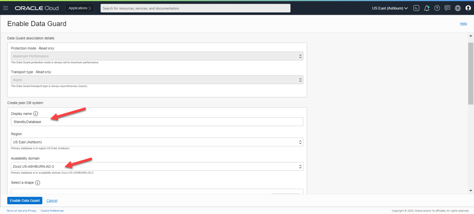
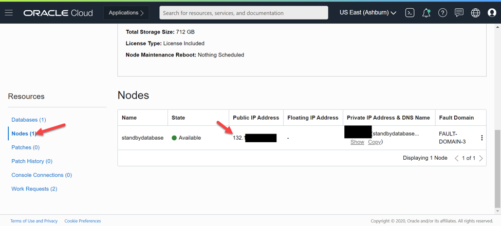

<!-- # Table of Contents

[Step 1: Provisioning the Primary database](#step-1-provisioning-the-primary-database)

[Step 2: Creating a Data Guard association](#step-2-creating-a-data-guard-association)

[Step 3: Connecting to databases & testing Data Guard build](#step-3-connecting-to-databases--testing-data-guard-build) -->
# OCI Active Data Guard

## Step 1: Provisioning the Primary database

Spin up a database using Oracle Cloud Infrastructure to serve as the "Primary" database

Click on the "Bare Metal, VM, and Exadata" tab under "Oracle Database" on the Cloud Console sidebar. 


Now let's create a DB System by clicking "Create DB System"


Fill out the information required. **Note:** for Data Guard to work properly, the shape, software edition **MUST** be the same as the standby database (we will configure this later).


In the following screenshot, please note: **Oracle Database Software Edition** was changed to **Enterprise Edition Extreme Performance**.

The most common use of Storage Management Software is Oracle Grid Infrastructure, but for quicker deployments you can use Logical Volume Manager.


Specify the network information. Note the arrows, meaning action or change is required on your part. Fill in the required information and click **Next**.


Provide additional information for the initial database.


Click **Create DB System** and let it provision. (_This may take up to an hour or even more depending on your shape configuration_.)


## Step 2: Creating a Data Guard association

Now that our database is provisioned and available, let's click on the database system name.


Scroll down and click on the database name.


Now, scroll down and click on **Data Guard Associations** on the left side, then click on **Enable Data Guard**.


Enter the **Data Guard Association** details. Then click **Enable Data Guard**. (_Note: this may take up to anhour or more to completely finish. You will also see a new database system appear with the name you provided_.)




## Step 3: Connecting to databases & testing Data Guard build

After the standby database has provisioned, we will need the IP address of the instance to connect to.


Scroll down and click **Nodes** to find the public IP address of the server. (_Note: do this for both the primary and standby databases_.)




Log into the servers using the IP address and SSH private key. Log in as the **opc** user on **both** servers.

Primary:


Standby:


On **BOTH** servers, enter the following commands:
```
 $ sudo su - oracle     // Changes the user to oracle.
 $ sqlplus / as sysdba  // Connects to the database.
```

After you are connected to the database, run the following query to verify both database roles. (_Note: run on **BOTH** databases_.)

```
SQL> select name, database_role, open_mode from v$database;
```

Primary:


Standby:


Now we can test if Data Guard is working correctly. On the **Primary** database, we will create a table and insert some data into it. (_Note: copying and pasting from this lab may not work due to formatting. Please type the commands manually_.)

```
SQL> create table employees(first_name varchar2(50));

SQL> insert into employees values ('thomas');

SQL> commit;
```


Now go to the **Standby** database and query the table that you just created on the primary database. (_Note: it may take a few minutes for the table to appear_.)

```
SQL> select * from employees;
```


### Congratulations! You have successfully completed this lab and configured a Data Guard build.

[Back to Top](#table-of-contents)


