# Manual Active Oracle Data Guard
<!-- ======================================================= -->

<!-- # Table of Contents
* [Why Active Data Guard?](#why)
* [Assumptions](#Assumptions)
* [Preparing Primary (Source) database](#primary-prep)
  * [Editing source Parameters](#primary-params)
  * [Copying source wallet directory, and password files](#primary-wallet-pass)
  * [Adding standby redo logs on source database](#primary-standby-logs)
  * [Grabbing source parameters for our target (standby) pfile](#primary-pfile)
* [Preparing Standby (Target) database](#target-prep)
  * [Copying wallet and password file to standby](#standby-copy-wallpass)
  * [Creating an audit directory](#standby-audit)
  * [Grabbing the DB domain](#standby-domain)
  * [Grabbing ASM directory names](#standby-asm)
  * [Creating our STANDBY pfile](#pfile_create)
  * [Testing pfile, and creating spfile](#pfile_test)
* [Setting up connectivity](#conn-setup)
  * [How to make the two databases able to connect to each other](#db_conn)
  * [Testing database connectivity](#test_db_conn)
* [Running active duplicate from primary](#rman-dupe)
* [Post active duplication steps](#rman-post-dupe)
  * [Starting MRP](#rman-mrp)
  * [Verifying log shipment](#rman-logs)
* [Making sure data is being replicated](#data-replication)
  * [Checking if PDBs are READ ONLY](#pdb_readonly)
  * [Checking for PDB violations](#pdb_violation)
  * [Creating a table on PRIMARY to see if it's replicated on STANDBY](#table_replication_test) -->

<!-- <a name="why"></a> -->


## Introduction

### Why Active Data Guard?
Active Data Guard is when the standby database is in READ ONLY WITH APPLY.

Some advantages -:
*	A lot of companies use the Read Only standby to perform reporting queries, since they could potentially slow down the primary. One of my previous customers used this scenario with their PeopleSoft payroll database.
*	Block corruptions are automatically repaired as long as the standby is running in real-time apply.
*	To also reduce the load on a production, you can imitate RMAN backups from the standby instead of the primary.

The Physical Standby can easily be opened if the Primary is lost. You first have to shut down the database, and bring it up in mount. You then issue a couple recover commands in SQL, and then activate the standby database. Once that’s all done, you can open it. 

### Objectives
- Understand the value of Oracle Active Data Guard.
- Configure Active Data Guard manually on a virtual machine database.
- Manually simulate a DR failover scenario using Manual Active Data Guard.

### Extra Resources
- [Opening a standby database after a failover](https://dbaclass.com/article/how-to-open-standby-database-when-primary-database-is-lost/)

<!-- ASSUMPTIONS SECTION START -->
<!-- ASSUMPTIONS SECTION START -->
<!-- ASSUMPTIONS SECTION START -->
<!-- <a name="Assumptions"></a> -->
## Assumptions and Pre-requisites
1. **Source** is Oracle Database 12c EE High Perf Release 12.2.0.1.0 - 64bit Production.
2. **Target** has Oracle Database 12c EE High Perf Release 12.2.0.1.0 - 64bit Production **binaries**.
3. If using OCI, both databases have appropriate security lists that can allow communication both ways.
4. You have the correct password for the SYS user on the source database.
5. Both Oracle environments have been set with .oraenv
6. A NFS shared between the two servers ([Learn how to make an NFS on OCI](https://docs.cloud.oracle.com/en-us/iaas/Content/File/Tasks/creatingfilesystems.htm))


#### Source (PRIMARY) Information
1. ORACLE_SID = NOAHONE
2. ORACLE_UNQNAME = ***NOAHONE_iad2b7***

#### Target (STANDBY) Information
1. ORACLE_SID = NOAHDR
2. ORACLE_UNQNAME = ***NOAHDR_iad38f***

#### What are binaries?
Binaries are when you have Oracle Database software installed, but you do not have any databases provisioned. You can achieve this by adding a new entry to the oratab, and using the same Oracle Home as a running database. You could also just install Oracle Software, or drop the current database.

#### What if I don't know the source SYS password?
***For sake of testing***, you can edit the SYS password like so -:
```
$ sqlplus / as sysdba
SQL> ALTER USER SYS IDENTIFIED BY [password];
SQL> ALTER USER SYSTEM IDENTIFIED BY [password];
SQL> exit
```
Otherwise, contact your DBA

<!-- [Top](#Table-of-Contents) -->
<!-- ASSUMPTIONS SECTION END -->
<!-- ASSUMPTIONS SECTION END -->
<!-- ASSUMPTIONS SECTION END -->

<!-- =========================================================================================== -->

<!-- SOURCE PREP SECTION START -->
<!-- SOURCE PREP SECTION START -->
<!-- SOURCE PREP SECTION START -->

<!-- <a name="primary-prep"></a> -->
## Preparing Primary Source database
First thing, we need to make sure our source database is in ARCHIVELOG mode.
```
$ sqlplus / as sysdba
SQL> select log_mode from v$database;
```
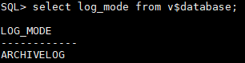

<!-- <a name="primary-params"></a> -->
#### Editing source Parameters
Next, we need to enable force logging and flashback on parameters. The parameters may already be enabled, which will give you an error -- but that's okay.
```
$ sqlplus / as sysdba
SQL> alter database force logging;
SQL> alter database flashback ON;
SQL> select force_logging from v$database;
SQL> select flashback_on from v$database;
```
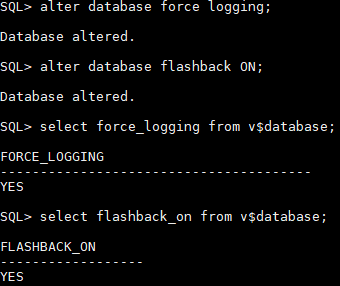

Now, we need to edit these source parameters. I would reccomened copying this into a notepad, and filling it out with your values. You can paste this all at once in SQL, just make sure it's line by line.
```
ALTER SYSTEM SET LOG_ARCHIVE_CONFIG='DG_CONFIG=(source_unqname,target_unqname)' scope=both;
ALTER SYSTEM SET LOG_ARCHIVE_DEST_1='location=USE_DB_RECOVERY_FILE_DEST’;
ALTER SYSTEM SET LOG_ARCHIVE_DEST_2='SERVICE=target_unqname LGWR ASYNC VALID_FOR=(ONLINE_LOGFILES,PRIMARY_ROLE) DB_UNIQUE_NAME=target_unqname' scope=both;
ALTER SYSTEM SET LOG_ARCHIVE_DEST_STATE_1=ENABLE scope=both;
ALTER SYSTEM SET LOG_ARCHIVE_DEST_STATE_2=ENABLE scope=both;
ALTER SYSTEM SET LOG_ARCHIVE_FORMAT='%t_%s_%r.dbf' SCOPE=SPFILE;
ALTER SYSTEM SET LOG_ARCHIVE_MAX_PROCESSES=30 scope=both;
ALTER SYSTEM SET REMOTE_LOGIN_PASSWORDFILE=EXCLUSIVE SCOPE=SPFILE;
ALTER SYSTEM SET fal_client=source_unqname scope=both;
ALTER SYSTEM SET fal_server=target_unqname scope=both;
ALTER SYSTEM SET STANDBY_FILE_MANAGEMENT=AUTO;
```
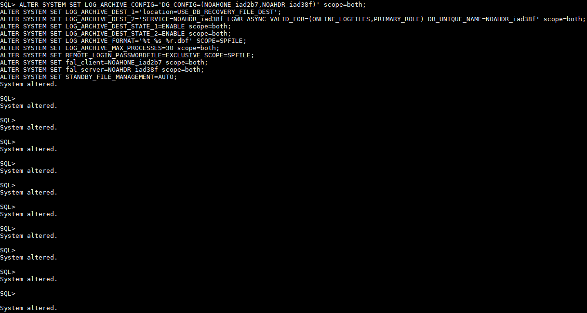

<!-- [Top](#Table-of-Contents) -->

<!-- <a name="primary-wallet-pass"></a> -->
#### Copying source wallet directory, and password files
By default, OCI encrypts the Database. This means we have to copy both the password file, as well as the contents of the wallet directory from our Source database, and add it to our target database. I am going to copy it to a shared NFS between the two servers. There's other ways like WinSCP, or using Linux Secure Copy (scp).

**How to get the wallet**
```
$ sqlplus / as sysdba
SQL> set lines 200
SQL> col WRL_PARAMETER format a60
SQK> col WRL_TYPE format a10
SQL> col status format a10
SQL> select * from v$encryption_wallet;
```
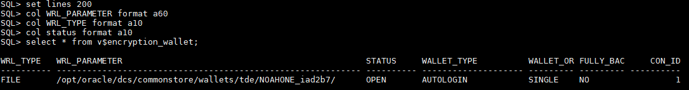

Now, I'm going to put the wallet contents into my NFS. You can either do this, SFTP them to your desktop, or scp them to the standby database in /tmp/ for now.
```
$ cd /opt/oracle/dcs/commonstore/wallets/tde/source_unqname/
$ mkdir -m 777 /ATX/NOAH/DG_WALLET
$ cp * /ATX/NOAH/DG_WALLET
```
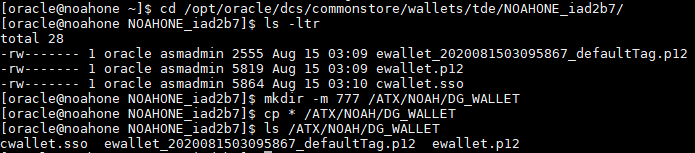

**How to get the password file**
```
$ cd $ORACLE_HOME/dbs
$ cp orapw{source_sid} /ATX/NOAH/DG_WALLET/orapw{target_sid}
```
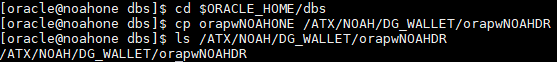

<!-- [Top](#Table-of-Contents) -->

<!-- <a name="primary-standby-logs"></a> -->
#### Adding standby redo logs on source database
You need to create standby redo logs on your source for maximum protection. Without creating standby logs, the standby will apply archived logs once they are created by RFS. Since standby cannot apply incomplete archive logs, you can see where the issue arises. [Learn more about it here](https://dbaclass.com/article/standby-redologs-oracle-dataguard/)

**First, check how many current redo logs you have on source**
```
$ sqlplus / as sysdba
$ set lines 180
$ col MEMBER for a60
$ select b.thread#, a.group#, a.member, b.bytes FROM v$logfile a, v$log b WHERE a.group# = b.group#;
```
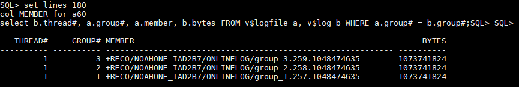

Now, in our case our thread (node) 1 has three redo logs (group 1,2,3). Usually your database will have a lot more, with multiple threads and unique groups. Now, we need to add standby logs to the source. We're going to add all of the current log count plus one in each group. So in our case, 3+1 = 4 total standby redo logs will be added (for thread 1)

**Steps to add standby logs**

Guidelines -:
  1. You cannot overlap groups (example if you have a redo log in group 1, you cannot add a standby log in group 1).
  2. You determine to amount of standby redo logs to add by taking the current redo log count, and adding one ***for each thread.***
  3. The standby redo logs must match the redo log size.
  4. Usually logs are added to the +RECO directory, but that is decided by the DBA. A lot of DBAs like keeping them seperate, so in our case it would go in +DATA.

Commands to add standby redo logs -:

```
$ sqlplus / as sysdba
SQL> alter database add standby logfile thread 1 group 4 ('+DATA','+RECO') size 1G;
SQL> alter database add standby logfile thread 1 group 5 ('+DATA','+RECO') size 1G;
SQL> alter database add standby logfile thread 1 group 6 ('+DATA','+RECO') size 1G;
SQL> alter database add standby logfile thread 1 group 7 ('+DATA','+RECO') size 1G;
```
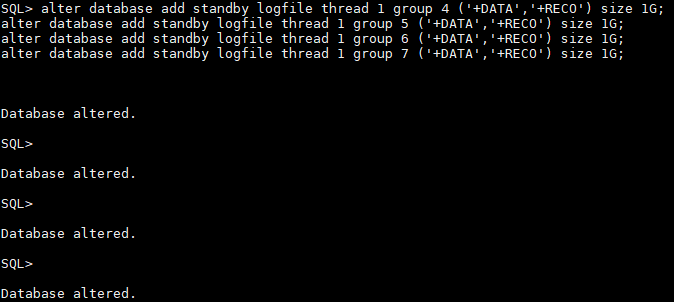

Check if they were added successfully (remember I multiplexed) -:
```
$ sqlplus / as sysdba
SQL> set lines 180
SQL> col MEMBER for a60
SQL> select b.thread#, a.group#, a.member, b.bytes FROM v$logfile a, v$standby_log b WHERE a.group# = b.group#;
```
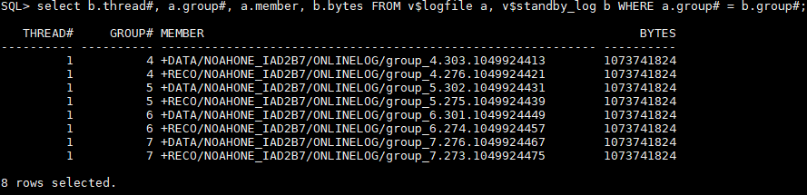

<!-- [Top](#Table-of-Contents) -->

<!-- <a name="primary-pfile"></a> -->
#### Grabbing source parameters for our target (standby) pfile
Last thing, we need to create a pfile from spfile on source (PRIMARY) and grab some of the parameters for our target (STANDBY) pfile.

```
$ sqlplus / as sysdba
SQL> create pfile='/tmp/grabbing.ora' from spfile;
SQL> exit
cat /tmp/grabbing.ora
```


This is going to be a big file, but grab these parameters for later -:
```
*.compatible
*.db_files
*.db_recovery_file_dest_size
*.enable_pluggable_database
*.open_cursors
*.pga_aggregate_target
*.sga_target
*.undo_tablespace (note -: you may have more than one undo, note them all)
```

A quick way to grab these parameters it to do this -:
```
$ grep -E '(\*\.compatible.*)|(\*\.open_cursors.*)|(\*\.pga_aggregate_target.*)|(\*\.sga_target.*)|(\*\..*undo_tablespace.*)|(\*\.enable_pluggable_database.*)|(\*\.db_files.*)|(\*\.db_recovery_file_dest_size.*)' /tmp/grabbing.ora
```
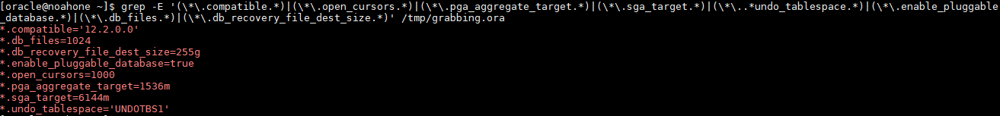

***NOW SAVE THESE FOR STEP Creating our STANDBY pfile***

<!-- [Top](#Table-of-Contents) -->
<!-- SOURCE PREP SECTION END -->
<!-- SOURCE PREP SECTION END -->
<!-- SOURCE PREP SECTION END -->


<!-- =========================================================================================== -->

<!-- TARGET PREP SECTION START -->
<!-- TARGET PREP SECTION START -->
<!-- TARGET PREP SECTION START -->
<!-- <a name="target-prep"></a> -->
## Preparing Standby Target database


<!-- <a name="standby-copy-wallpass"></a> -->
#### Copying wallet and password file to standby
This is pretty straight forward, just copy the files from your NFS, Desktop, or /tmp/ folder into their correct places.

**Wallet**

First, grab the location of your target wallet
```
$ sed '/ORACLE_UNQNAME/{s/\(.*ORACLE_UNQNAME\).*/\1/;q}' $ORACLE_HOME/network/admin/sqlnet.ora | sed 's/.*=//'
```
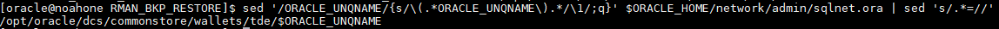

Now, we're going to go to that directory and backup everything so it's empty.
```
$ cd /opt/oracle/dcs/commonstore/wallets/tde/$ORACLE_UNQNAME
$ ls -ltr | wc -l
$ mkdir -m 777 /tmp/wallet_bak
$ mv * /tmp/wallet_bak
$ ls -ltr | wc -l
```
The final wc -l should just be 1

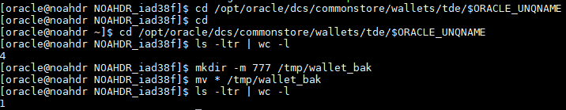

Now, we're going to copy the ***WALLET*** files from our NFS. If you used SFTP then copy from desktop. If you used SCP copy from the /tmp/ directory.
```
$ cd /opt/oracle/dcs/commonstore/wallets/tde/$ORACLE_UNQNAME
$ cp /ATX/NOAH/DG_WALLET/orapw{target_sid} .
```
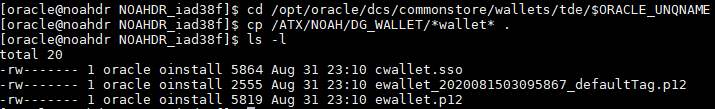

**Password file**

```
$ cd $ORACLE_HOME/dbs
$ mv orapw{target_sid} BACKUP_orapw{target_sid}
$ cp /ATX/NOAH/DG_WALLET/
$ ls -ltr *orapw*
```

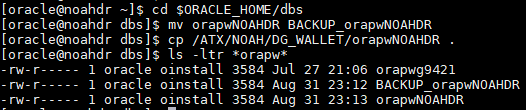

<!-- [Top](#Table-of-Contents) -->

<!-- <a name="standby-audit"></a> -->
#### Creating an audit directory
You need an audit directory, OCI creates one already for our database but you can create and directory and specify it in the pfile we're going to make below. Just note down the directory, in our case I'm going to use /u01/app/oracle/admin/NOAHDR_iad38f/adump. Since I already have it, I'll just show a screenshot of running ls on it.
```
$ mkdir -m 777 $ORACLE_BASE/admin/target_unqname/adump
```
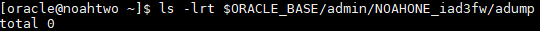

***NOTE THE DIRECTORY DOWN YOU MADE, FOR FILLING IN THE STANDBY PFILE BELOW***

<!-- [Top](#Table-of-Contents) -->

<!-- <a name="standby-domain"></a> -->
#### Grabbing the DB domain
Now, the last parameter we need to grab is the db_domain. If you're on OCI, and the two databases are in the same subnet you can just use the db_domain parameter on the source. There are a few ways to grab it regardless, so I'll show you that.

**The best way is to just get the domain in the connect string and take out the DB_UNQNAME like so -:**
```
$ cat $ORACLE_HOME/network/admin/tnsnames.ora
```
Now, once you ran the cat you want to take ***THE CURRENT TARGET DATABASE ENTRY*** Look at the screenshot below for what I mean.
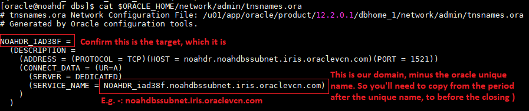

So, our domain name is noahdbssubnet.iris.oraclevcn.com based off of this.

**You can also run this Linux command**
```
$ hostname -A
```
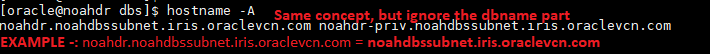

Same concept as above.

**If on OCI, you can check on the instance details page**
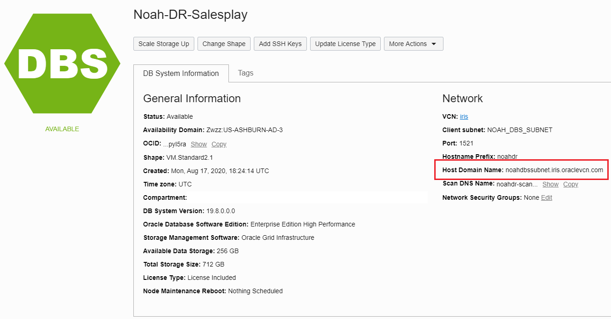

***NOTE THE DOMAIN NAME, FOR FILLING IN THE STANDBY PFILE BELOW***

<!-- [Top](#Table-of-Contents) -->

<!-- <a name="standby-asm"></a> -->
#### Grabbing ASM directory names
Default OCI is just +DATA and +RECO, but I've seen DBAs who have +RECO4, +RECOC, etc... A quick and fast way to check is to just do this. **If for some reason this command doesn't work as Oracle user, change to Grid user.**
```
$ asmcmd ls -l
```
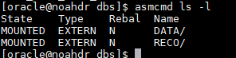

In our case, our ASM data directory is '+DATA', and our ASM reco directory is "+RECO".

***NOTE THE DATA / RECO LOCATION FOR FILLING IN THE STANDBY PFILE BELOW***

<!-- [Top](#Table-of-Contents) -->

<!-- <a name="pfile_create"></a> -->
#### Creating our STANDBY pfile
We need to create a pfile that we can use to startup our empty target (standby) database. Make sure your are doing this on the ***TARGET (STANDBY)*** database. These are the steps -:
```
$ cd $ORACLE_HOME/dbs
$ mv init{target_sid}.ora OLD_init{target_sid}.ora
$ vi init{target_sid}.ora
```

Now, edit the below to fit your parameters and then paste it into the init{target_sid}.ora file, then save and exit the vi editor. ***Don't forget your parameters you grabbed above*** also, don't forget about the **apostrophes  ' '** in some of the parameters. Oracle is pretty specific with errors on trying to startup with a pfile, and it will let you know if there are missing apostrophes.
```
*.audit_file_dest='/u01/app/oracle/admin/target_unqname/adump'
*.audit_trail='db'
*.enable_pluggable_database={grabbed from /tmp/grabbing.ora on source}
*.compatible='{grabbed from /tmp/grabbing.ora on source}'
#*.control_files='+DATA/target_unqname/controlfile/current.268.900456457'
*.db_files={grabbed from /tmp/grabbing.ora on source}
*.db_block_size=8192
*.db_create_file_dest='+DATA'
*.db_domain='{Grabbing the DB domain}'
*.db_name='source_sid'
*.db_unique_name='target_unqname'
*.db_recovery_file_dest='+RECO'
*.db_recovery_file_dest_size={grabbed from /tmp/grabbing.ora on source}
*.diagnostic_dest='/u01/app/oracle'
*.fal_client='target_unqname'
*.fal_server='source_unqname'
*.log_archive_config='DG_CONFIG=(target_unqname,source_unqname)'
*.log_archive_dest_1='location=USE_DB_RECOVERY_FILE_DEST'
*.log_archive_dest_2='SERVICE=source_unqname LGWR ASYNC VALID_FOR=(ONLINE_LOGFILES,PRIMARY_ROLE) DB_UNIQUE_NAME=source_unqname'
*.log_archive_dest_state_1='ENABLE'
*.log_archive_dest_state_2='DEFER'
*.log_archive_format='%t_%s_%r.dbf'
*.open_cursors={grabbed from /tmp/grabbing.ora on source}
*.pga_aggregate_target={grabbed from /tmp/grabbing.ora on source}
*.sga_target={grabbed from /tmp/grabbing.ora on source}
*.remote_login_passwordfile='EXCLUSIVE'
*.standby_file_management='AUTO'
*.undo_tablespace='{grabbed from /tmp/grabbing.ora on source}'
*.log_file_name_convert='+RECO/source_unqname/ONLINELOG','+RECO/target_unqname/ONLINELOG'
*.log_file_name_convert='+DATA/source_unqname/ONLINELOG','+DATA/target_unqname/ONLINELOG'
*.db_file_name_convert='+DATA/source_unqname/DATAFILE','+DATA/target_unqname/DATAFILE'
```

Don't forget to save and exit VI (:x or :wq), and make sure there are no extra lines or missing apostrophes!
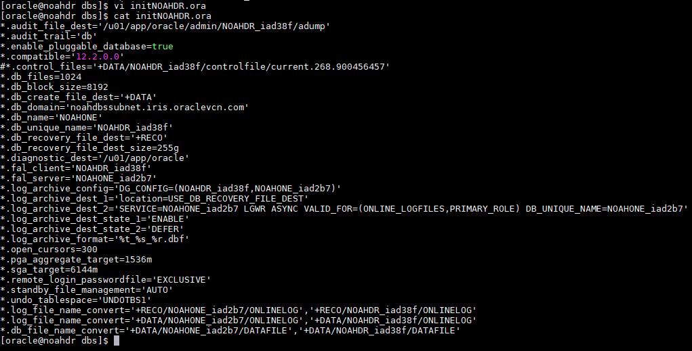

<!-- [Top](#Table-of-Contents) -->

<!-- <a name="pfile_test"></a> -->
#### Testing pfile, and creating spfile
This is where it can get annoying, but Oracle's error handling is pretty good. We're going to use the pfile we just created to startup the database in nomount. We are then going to create an spfile into our ASM data directory from the pfile.

To startup the database with our pfile -:
```
$ sqlplus / as sysdba
SQL> startup nomount pfile='$ORACLE_HOME/dbs/init{target_sid}.ora';
```
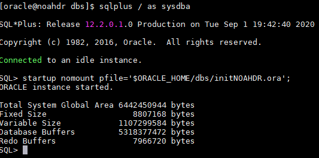

Now, create a spfile from this pfile. We do this so everytime we start up the database, it's going to use the spfile. That's why we "test" the pfile first before converting it, to make sure it'll work.
```
SQL> create spfile='+{asm_data}/{target_unqname}/spfile{target_sid}.ora' from pfile='$ORACLE_HOME/dbs/init{target_sid}.ora';
SQL> startup nomount force;
SQL> show parameter spfile;
```
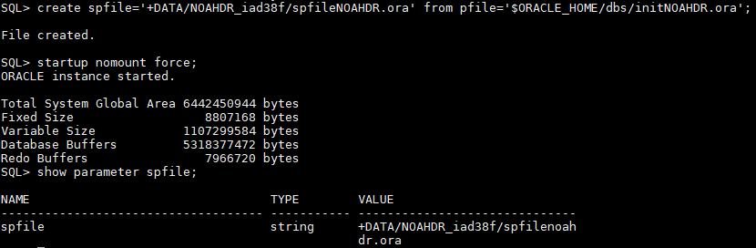

Now, we know that it works. Take the result from "show parameter spfile" and copy it for our next step. We're now going to edit the pfile we originally made, and remove everything. All we're going to have in the pfile is a reference to the "show parameter spfile". We're also going to backup the pfile we made, just incase we need to use it later for troubleshooting.

Backup our pfile we made -:
```
$ cd $ORACLE_HOME/dbs
$ mv init{target_sid}.ora RECOVERY_init{target_sid}.ora
```
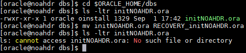

Now, created a pfile named init{target_sid}.ora, and add the one line, screenshot below.
```
$ vi init{target_sid}.ora
(add your show parameter spfile)
```
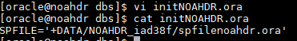

<!-- [Top](#Table-of-Contents) -->
<!-- TARGET PREP SECTION END -->
<!-- TARGET PREP SECTION END -->
<!-- TARGET PREP SECTION END -->

<!-- =========================================================================================== -->

<!-- CONNECTIVITY SECTION START -->
<!-- CONNECTIVITY SECTION START -->
<!-- CONNECTIVITY SECTION START -->

<!-- <a name="conn-setup"></a> -->
## Setting up connectivity between source and target
In order to allow cross connection between our two databases, we're going to have to add entries to both tnsnames.ora in $ORACLE_HOME/network/admin. Go ahead and cat the tnsnames.ora, and you can get an idea of what it looks like.

SOURCE
```
$ cat $ORACLE_HOME/network/admin/tnsnames.ora
```
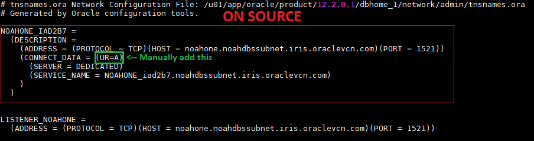

TARGET
```
$ cat $ORACLE_HOME/network/admin/tnsnames.ora
```
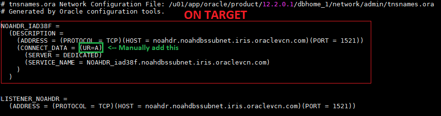


<!-- [Top](#Table-of-Contents) -->

<!-- <a name="db_conn"></a> -->
#### How to make the two databases able to connect to each other
Now that you have ran cat on both tnsnames.ora, you can edit each one accordingly. For example, on source you will add the target entry below, and vice versa. To do this, you can use vi. Once you edit them, it should look similar to the screenshot below.

***NOTE -: ADD (UR=A) after (CONNECT_DATA = like in the screenshots below***
```
$ vi $ORACLE_HOME/network/admin/tnsnames.ora
```
SOURCE

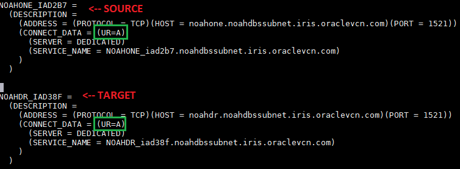

TARGET

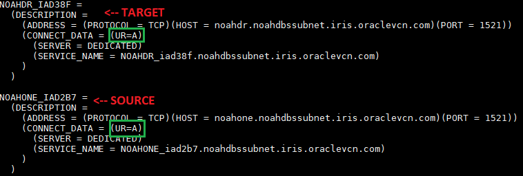

<!-- [Top](#Table-of-Contents) -->

<!-- <a name="test_db_conn"></a> -->
#### Testing database connectivity
##### TESTING CONNECTIVITY FROM TARGET (STANDBY) TO SOURCE (PRIMARY)!!!!
***AKA, MAKE SURE YOU'RE RUNNING THIS ONE ON THE TARGET DATABASE***
```
sqlplus sys/[password]@[source_unqname] as sysdba
```


##### TESTING CONNECTIVITY FROM SOURCE (PRIMARY) TO TARGET (STANDBY)!!!!
***AKA, MAKE SURE YOU'RE RUNNING THIS ONE ON THE SOURCE DATABASE***
```
sqlplus sys/[password]@[target_unqname] as sysdba
```
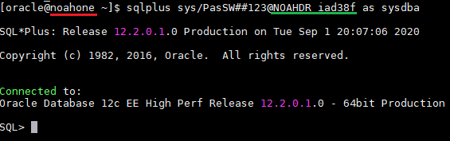

If you can connect, configurations... you're really close! If not, it's always going to be something with networking, which means it can be your listener or OCI security lists.

[Information on the Oracle listener](https://docs.oracle.com/cd/B19306_01/network.102/b14212/connect.htm)

[Information on OCI security lists](https://docs.cloud.oracle.com/en-us/iaas/Content/Network/Concepts/securitylists.htm)

<!-- [Top](#Table-of-Contents) -->
<!-- CONNECTIVITY SECTION END -->
<!-- CONNECTIVITY SECTION END -->
<!-- CONNECTIVITY SECTION END -->

<!-- =========================================================================================== -->

<!-- DUPLICATION SECTION START -->
<!-- DUPLICATION SECTION START -->
<!-- DUPLICATION SECTION START -->
<!-- <a name="rman-dupe"></a> -->
## Running active duplicate from primary
#### Make sure you're on the SOURCE (PRIMARY) database!!
You may see "target" and get confused, but just follow the syntax. Basically, you target into your current source database and then set the target as your auxiliary all in this one liner.
```
$ rman target sys/[password]@[source_unqname] auxiliary sys/[password]@[target_unqname]
```
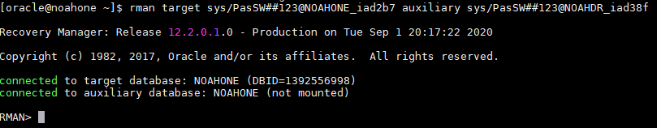

Now, just run this command and it'll duplicate to the standby. If it fails, Oracle has pretty good error handling and will give you specifics. This will take some time depending on your database size, in a lab environment it will run rather quick since you don't have much data. If this is a big database though, I would recommend making a .sh script with the rman connect string, and a run code block with the command below. Then nohup ./ the script, then tail the nohup. This makes it run in the background.
```
RMAN> duplicate target database for standby from active database nofilenamecheck;
```
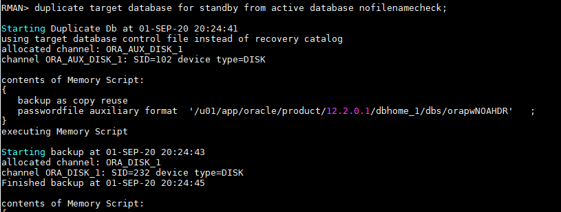
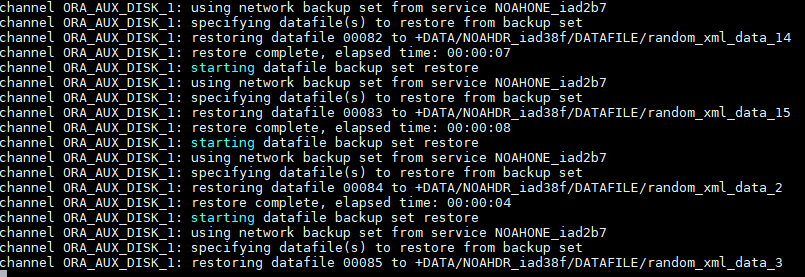

Once you see this, it is done... You'll now need to do some more work to finish everything up
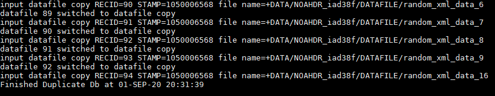

<!-- [Top](#Table-of-Contents) -->
<!-- DUPLICATION SECTION END -->
<!-- DUPLICATION SECTION END -->
<!-- DUPLICATION SECTION END -->

<!-- =========================================================================================== -->

<!-- POST DUPLICATION SECTION START -->
<!-- POST DUPLICATION SECTION START -->
<!-- POST DUPLICATION SECTION START -->
<!-- <a name="rman-post-dupe"></a> -->
## Post active duplication steps
<!-- <a name="rman-mrp"></a> -->
#### Starting MRP (ON THE TARGET (STANDBY) DATABASE!!!!)
Now that the duplication is done, we have to start MRP. MRP is just a tool that applies information from the redo logs to the standby database. It basically just syncs it up, and keeps it in sync while it's running.

Check the status of the **standby** it should be mounted, and have a role of Physical Standby.
```
$ sqlplus / as sysdba
SQL> select name, open_mode, database_role, INSTANCE_NAME from v$database,v$instance;
```
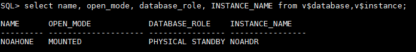

Now we're going to open it up, and start MRP. You can also run the prep command in order to see if MRP is running or not, to periodically check and confirm.
```
$ sqlplus / as sysdba
SQL> alter database open;
SQL> select name, open_mode, database_role, INSTANCE_NAME from v$database,v$instance;
SQL> alter database recover managed standby database disconnect from session;
SQL> select name, open_mode, database_role, INSTANCE_NAME from v$database,v$instance;
SQL> !ps -ef | grep mrp
```
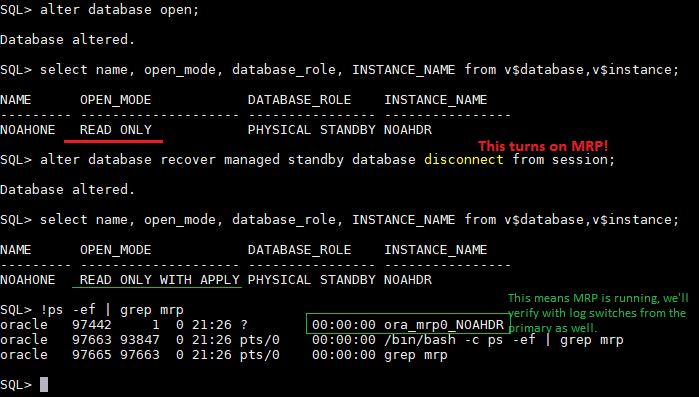

<!-- [Top](#Table-of-Contents) -->

<!-- <a name="rman-logs"></a> -->
#### Verifying log shipment from primary to standby
First, go to the primary database and then we're going to do some log switches, and grab the sequence number that is writing on the primary. The standby should then be receiving and applying that sequence number.

***ON SOURCE***
```
$ sqlplus / as sysdba
SQL> alter system switch logfile;
SQL> alter system switch logfile;
SQL> alter system switch logfile;
SQL> set lines 200
SQL> select process,status,client_process,group#,thread#,sequence# from  V$MANAGED_STANDBY order by sequence#;
```
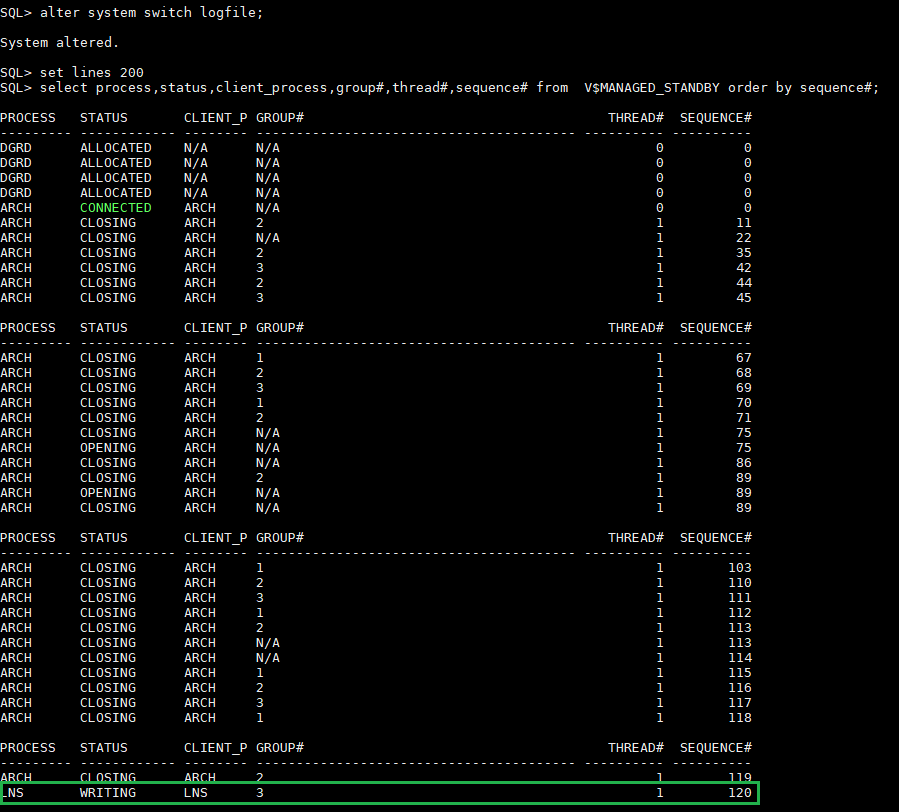

***ON TARGET***
The sequence # that was writing should now be receiving / applying.
```
$ sqlplus / as sysdba
SQL> set lines 200
SQL> select process,status,client_process,group#,thread#,sequence# from  V$MANAGED_STANDBY order by sequence#;
```
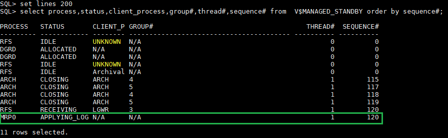

You can also check the alert log, by looking for sequence numbers that are in transit.
```
$ cd cd $ORACLE_BASE/diag/rdbms/{target_unqname_lowercase}/{target_sid}/trace
$ tail -30 alert_{target_sid}.log
```
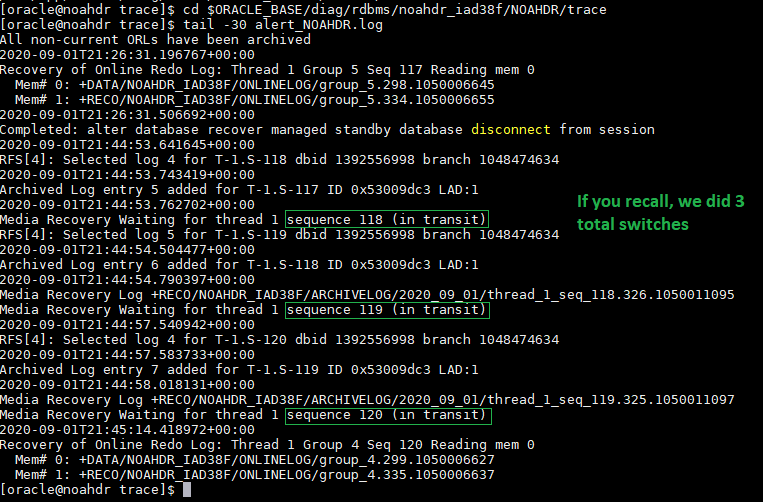

<!-- [Top](#Table-of-Contents) -->
<!-- POST DUPLICATION SECTION END -->
<!-- POST DUPLICATION SECTION END -->
<!-- POST DUPLICATION SECTION END -->

<!-- =========================================================================================== -->

<!-- Making sure data is replicated SECTION START -->
<!-- Making sure data is replicated SECTION START -->
<!-- Making sure data is replicated SECTION START -->
<!-- <a name="data-replication"></a> -->
## Making sure data is being replicated

<!-- <a name="pdb_readonly"></a> -->
#### Checking if PDBs are READ ONLY

On our source, there is one PDB named "SRC_PDB", so let's check our standby.

***ON STANDBY***
```
$ sqlplus / as sysdba
SQL> sho pdbs
```
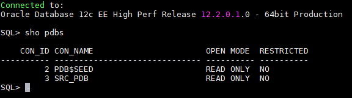

As you can see it was replicated, this is good obviously. Notice it's in READ ONLY mode, this is because this in an Active Data Guard (which means the database is always a read only version.)

<!-- [Top](#Table-of-Contents) -->

<!-- <a name="pdb_violation"></a> -->
##### Checking for PDB violations (we know there are none since it's not restricted, but this is a good query to know.)
```
$ sqlplus / as sysdba
SQL > alter session set container={PDB_NAME};
SQL> set lines 200
SQL> set lines 999
SQL> col message format a70
SQL> col status format a15
SQL> col type format a10
SQL> col name format a10
SQL> select name, cause, type, message, status from pdb_plug_in_violations where type='ERROR' and status='PENDING';
```
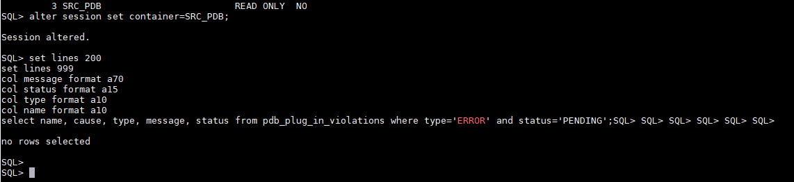

<!-- [Top](#Table-of-Contents) -->

<!-- <a name="table_replication_test"></a> -->
##### Creating a table on PRIMARY to see if it's replicated on STANDBY

***ON PRIMARY***

First, let's check free space on a tablespace, and create a table inside one with some space. This is a good query to have as well.

```
$ sqlplus / as sysdba
SQL > alter session set container={PDB_NAME};

select
   fs.tablespace_name                          "Tablespace",
   (df.totalspace - fs.freespace)              "Used MB",
   fs.freespace                                "Free MB",
   df.totalspace                               "Total MB",
   round(100 * (fs.freespace / df.totalspace)) "Pct. Free"
from
   (select
      tablespace_name,
      round(sum(bytes) / 1048576) TotalSpace
   from
      dba_data_files
   group by
      tablespace_name
   ) df,
   (select
      tablespace_name,
      round(sum(bytes) / 1048576) FreeSpace
   from
      dba_free_space
   group by
      tablespace_name
   ) fs
where
   df.tablespace_name = fs.tablespace_name
   order by 1;
```
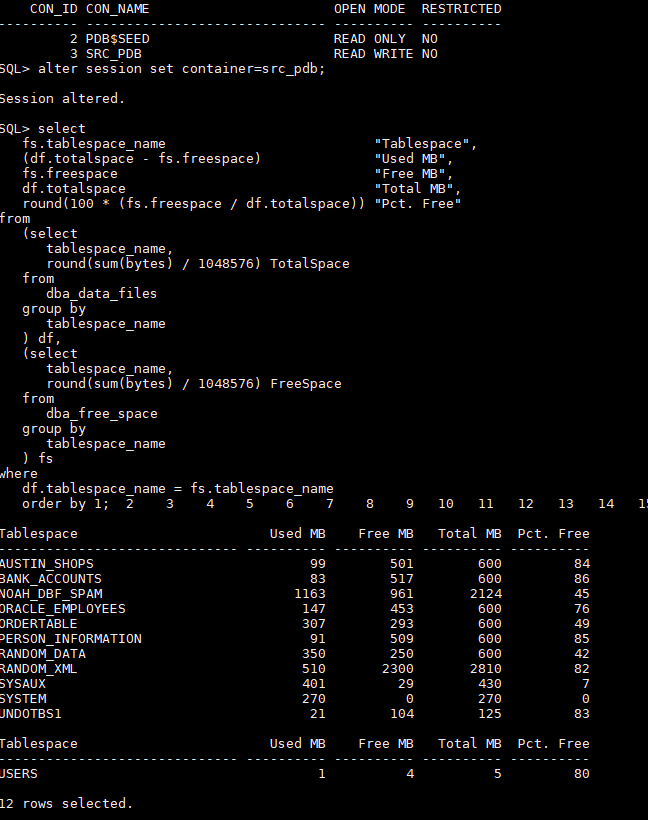

If you need to add space to a tablespace, use the below -:
```
$ sqlplus / as sysdba
SQL > alter session set container={PDB_NAME};

ALTER TABLESPACE tablespace_name
    ADD DATAFILE 'path_to_datafile'
    SIZE size;
```

We're going to use **AUSTIN_SHOPS** since there's a lot of free space there.

***ON PRIMARY, YOU CAN COPY THE WHOLE STATEMENT FROM CREATE TABLE TO COMMIT;***
```
$ sqlplus / as sysdba
SQL > alter session set container={PDB_NAME};

CREATE TABLE DG_LAB_TEST (
  test NUMBER(9)
)
TABLESPACE AUSTIN_SHOPS;

insert into DG_LAB_TEST values(1);
insert into DG_LAB_TEST values(2);
insert into DG_LAB_TEST values(3);

commit;
```
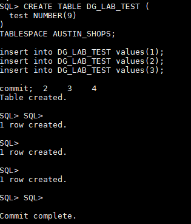

***ON PRIMARY***
```
SQL > select * from DG_LAB_TEST;
```
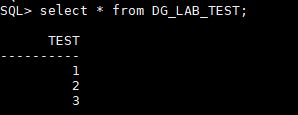

Now, let's check on the Standby (wait a minute or so, usually ~10 seconds depending on latency.)

***ON STANDBY***
```
$ sqlplus / as sysdba
SQL > alter session set container={PDB_NAME};
SQL > select * from DG_LAB_TEST;
```
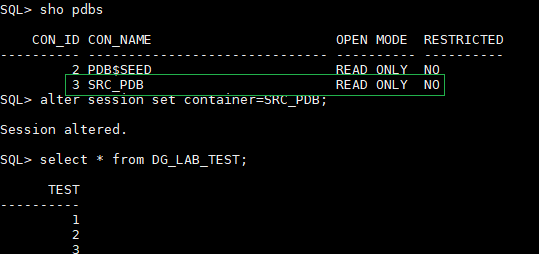


## Data Broker and disaster simulation
The last thing we need to do is activate Data Broker. This is a tool that allows for easy switchover, failover, flashback, and turning your standby into a snapshot. It's also mainly used for seeing things like transport lag, because ideally you're not going to worry about recovery until it happens. The only thing you'll really need to be interested in is turning your database into a snapshot for testing.


<!-- <a name="data-enable-broker"></a> -->
##### Enabling the broker
You will have to run this SQL statement on ***both the standby and primary***
```
$ sqlplus / as sysdba
SQL > ALTER SYSTEM SET dg_broker_start=true;
```
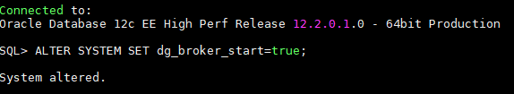

Next, we will need to register the broker with the primary, and link the standby. We can then check to see if it was all successful.

***RUN ALL OF THIS IN THE PRIMARY!!***
```
$ dgmgrl sys/[password]@[source_unqname]
DGMGRL >  CREATE CONFIGURATION lab_dg AS PRIMARY DATABASE IS [source_unqname] CONNECT IDENTIFIER IS [source_unqname];
DGMGRL >  ADD DATABASE [target_unqname] AS CONNECT IDENTIFIER IS [target_unqname] MAINTAINED AS PHYSICAL;
DGMGRL > ENABLE CONFIGURATION;
DGMGRL > SHOW CONFIGURATION;
DGMGRL > show database [source_unqname];
DGMGRL > show database [target_unqname];
```
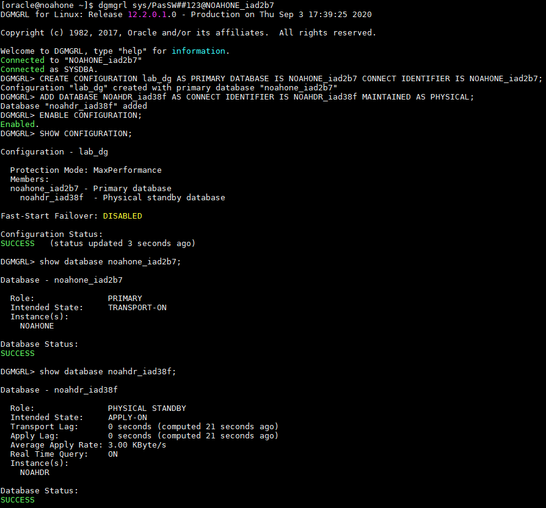

<!-- [Top](#Table-of-Contents) -->

<!-- <a name="data-switchover"></a> -->
##### Performing a switchover
Now we can simulate a switchover, it's fairly simple. Run these commands, and then when you connect to the **ORIGINAL primary** it will be in read only mode.
***RUN THIS ON THE PRIMARY!!!***
```
$ dgmgrl sys/[password]@[source_unqname]
DGMGRL >  CREATE CONFIGURATION lab_dg AS PRIMARY DATABASE IS [source_unqname] CONNECT IDENTIFIER IS [source_unqname];
DGMGRL >  ADD DATABASE [target_unqname] AS CONNECT IDENTIFIER IS [target_unqname] MAINTAINED AS PHYSICAL;
DGMGRL >  switchover to [target_unqname];
DGMGRL >  exit
$ sqlplus / as sysdba
SQL > sho pdbs;
SQL > exit
```
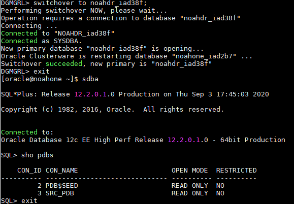

You can see they're now swapped with these commands

***RUN THIS ON THE ORIGINAL PRIMARY!!!***
```
$ dgmgrl sys/[password]@[target_unqname]
DGMGRL > show database [source_unqname];
DGMGRL > show database [target_unqname];
```
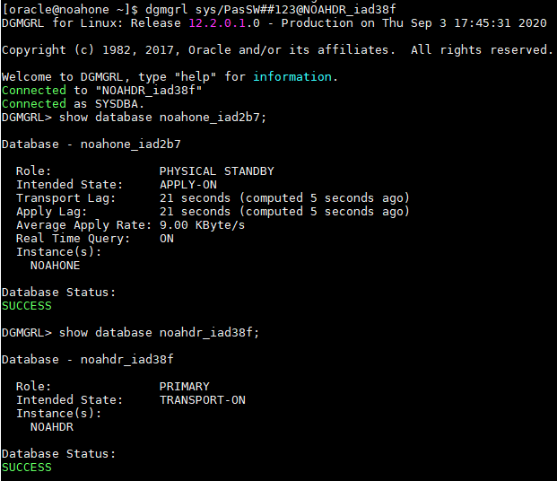

Now, let's switch back to the ORIGINAL PRIMARY

***RUN THIS ON YOUR CURRENT BROKER SESSION***
```
DGMGRL > switchover to [source_unqname];
DGMGRL > show database [target_unqname];
DGMGRL > show database [source_unqname];
DGMGRL > exit
```
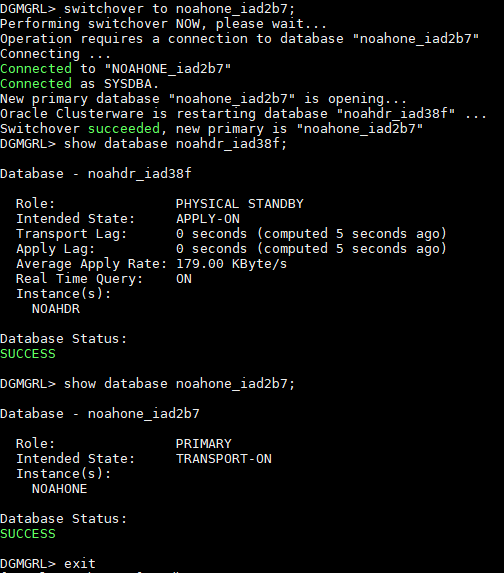


<!-- [Top](#Table-of-Contents) -->

<!-- <a name="data-failover"></a> -->
##### Performing a Failover
This would be if the primary got shut off, or crashed. For the simulation we’re just going to shut down the primary database.

***RUN THIS ON THE PRIMARY!!!***
```
$ sqlplus / as sysdba
SQL> shut immediate
SQL> exit
```
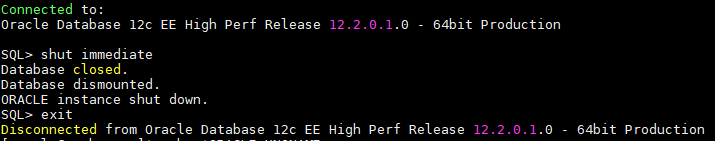

Now, let's connect to the standby via broker on the primary host.

***RUN THIS ON THE PRIMARY!!!***
```
$ dgmgrl sys/[password]@[target_unqname]
DGMGRL > failover to [target_unqname];
DGMGRL > show database [source_unqname];
DGMGRL > show database [target_unqname];
```


Now, since we enabled flashback when we first started our Data Guard build, it's very simple to reinstate our original primary database. Follow these steps, first we startup the original primary, then we reinstate through broker.

***RUN THIS ON THE ORIGINAL PRIMARY!!!***
```
$ sqlplus / as sysdba
SQL > startup mount
SQL > exit
$ dgmgrl sys/[password]@[target_unqname]
DGMGRL > REINSTATE DATABASE [source_unqname];
DGMGRL > show database [source_unqname];
DGMGRL > show database [target_unqname];
```


Our original primary is now our standby, so we have to switchover to make it the new primary.

***Stay in the same broker session, don’t exit broker!!!***
```
DGMGRL >  switchover to [source_unqname];
```


Now, our standby will not be able to determine lag, this is because we need to re-enable broker on the ORIGINAL STANDBY. Run this on the same broker you’re in, and you can see what I mean.
```
DGMGRL >  show database [target_unqname];
```


***Go back to the ORIGINAL STANDBY and re-enable broker through SQL***
```
$ sqlplus / as sysdba
SQL > ALTER SYSTEM SET dg_broker_start=true;
```


Now, go back to the ORIGINAL PRIMARY server, and connect to it in broker, and you can see our standby is applying, and we can see the lag.

***RUN THIS ON THE ORIGINAL PRIMARY!!!***
```
$ dgmgrl sys/[password]@[source_unqname]
DGMGRL > show database [target_unqname];
```


**If you didn’t have alter database flashback ON;** parameter set **(you should, It was the first thing I made you do,)** you will have to re-create the whole standby. But you can just drop the database on standby, and run the duplicate command again – no need to do all the other steps.

<!-- [Top](#Table-of-Contents) -->

<!-- <a name="data-snapshot"></a> -->
##### Turning the standby into a snapshot of the primary for testing
You can turn your standby into a read-write, and use it as a lab because it takes a snapshot of when you did it. You can edit tables, add tables, experiment, etc… Once you are done, you can convert the standby back into a physical standby and all changes will be lost.

***Let’s convert our standby, run this on the PRIMARY***
```
$ dgmgrl sys/[password]@[source_unqname]
DGMGRL > CONVERT DATABASE [target_unqname] TO SNAPSHOT STANDBY;
```

Now let’s go on our **original standby** and see if the PDBs are read-write

***RUN THIS ON THE ORIGINAL STANDBY!!!***
```
$ sqlplus / as sysdba
SQL > sho pdbs
```


Cool, they are – lets go into the PDB and create a table.

***RUN THIS ON THE ORIGINAL STANDBY!!!***
```
SQL > alter session set container={PDB_NAME};
SQL > create table snapshot_test ( test NUMBER(5));.
SQL > insert into snapshot_test values(1);
SQL > commit;
SQL > select * from snapshot_test;
```


Now, since we’re done we’re going to convert it back to a physical standby to revert the changes, and sync up with our primary.

***RUN THIS ON THE ORIGINAL PRIMARY, BROKER INTO THE PRIMARY***
```
$ dgmgrl sys/[password]@[source_unqname]
DGMGRL > CONVERT DATABASE [target_unqname] TO PHYSICAL STANDBY;
```


Once that is done, let’s see the configuration to verify
```
DGMGRL > SHOW CONFIGURATION;
```


Notice our lag isn't determined, this is because we need to re-enable broker on our ORIGINAL STANDBY.

***Go back to the ORIGINAL STANDBY and re-enable broker through SQL***
```
$ sqlplus / as sysdba
SQL > ALTER SYSTEM SET dg_broker_start=true;
```


***Now, go back to the ORIGINAL PRIMARY and check***
```
$ dgmgrl sys/[password]@[source_unqname]
DGMGRL > SHOW CONFIGURATION;
DGMGRL > show database [target_unqname];
```


***Go back to the ORIGINAL STANDBY and verify PDB is read only***
```
$ sqlplus / as sysdba
SQL > sho pdbs
```


***Let's see if the table from our post snapshot was deleted***
```
SQL > alter session set container={PDB_NAME};
SQL > select * from snapshot_test;
```


### ALL DONE WITH LAB!
<!-- [Top](#Table-of-Contents) -->
<!-- Making sure data is replicated SECTION END -->
<!-- Making sure data is replicated SECTION END -->
<!-- Making sure data is replicated SECTION END -->

<!-- =========================================================================================== -->
